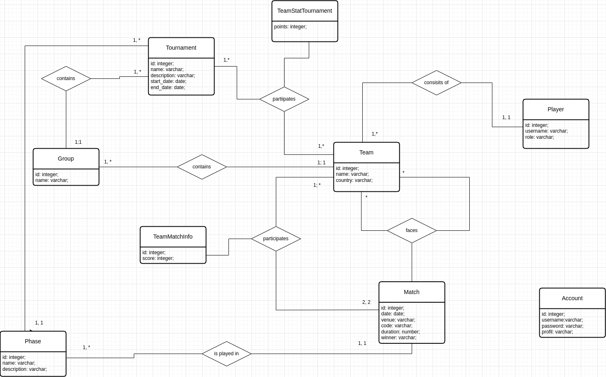
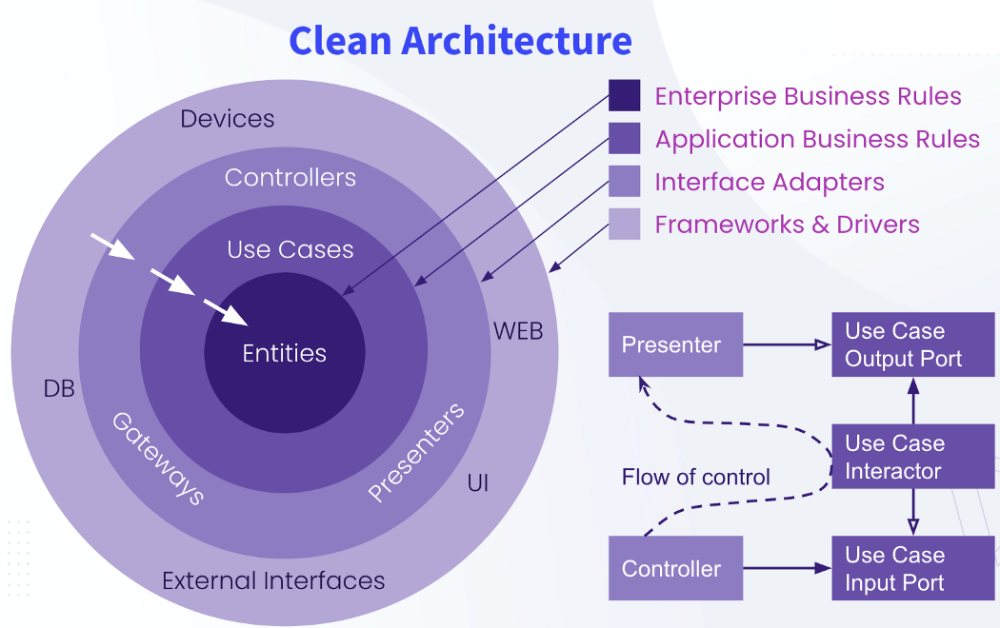

# score-management-app

## Entity Relationnal Diagram

## Chosen Architecture

## Data Security Policy
 - JWT authentication
 - Encrypted password 

## Get started

 - git clone https://github.com/Duamelo/score-management-app.git

 ### Requirements

    - node js
    - websocket
    - postgresql
    - Typeorm (as DAO)

### Node js installation
  - [ubuntu 20.04](https://www.digitalocean.com/community/tutorials/how-to-install-node-js-on-ubuntu-20-04-fr)
  - [windows](https://nodejs.org/en/download/)

### Postgresql installation

  - [ubuntu 20.04](https://www.digitalocean.com/community/tutorials/how-to-install-postgresql-on-ubuntu-20-04-quickstart)
  - [windows 10](https://www.veremes.com/installation-postgresql-windows)

### Dependances installation

    - cd scoreui && npm install
    - cd scoreapi && npm install

## Editing the .env file in the scoreapi directory
    - POSTGRES_HOST = localhost
    - POSTGRES_PORT = 5432
    - POSTGRES_USER = your_username
    - POSTGRES_PASSWORD = your_password
    - POSTGRES_DB = scoredb
    - JWT_SECRET = yatuezytyeztyezrtzyitazeyuazyziu
    - JWT_EXPIRATION_TIME = 36000
    - PORT=5000

## Database creation

    - create a user name {{username}}
    - replace duamelo with {{username}} in the score.sql script
    - restore database: psql database_name < score.sql
    - export existing database (for information): pg_dump -U username -p 5432 database_name > score.sql

## Launch application

    - cd scoreui 
    - run this command: npm run dev
    - cd scoreapi
    - run this command: npm run dev

## Profils (for testing)

### Admin
    - username: franck
    - password: 123456789

## Versions
    - Node js v18.17.1
    - npm v9.6.7

## Authors

* **David DOSSEH** _alias_[@Duamelo](https://github.com/Duamelo)

## Licence
